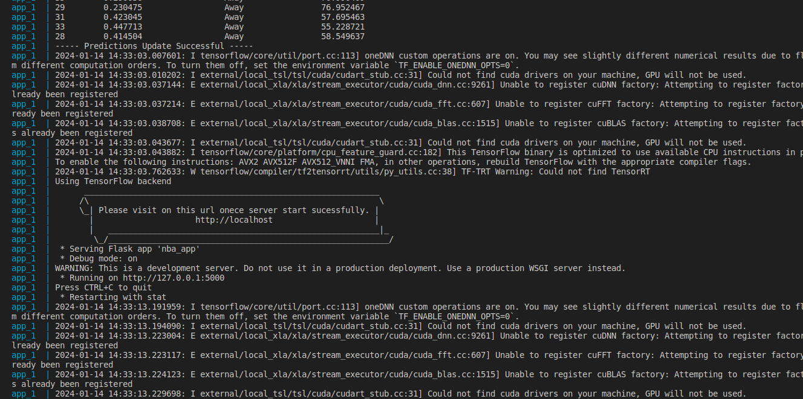

# NBA Betting Project Setup Guide

This guide outlines the steps to set up the NBA Betting project on your local machine.

## Step 1: Download and install Docker

Skipping this assuming you have Docker.

## Step 2: Build Docker Container and image

Run this command in your terminal to build Docker container

```bash
docker-compose up --build
```

Note:- it may take a while first time you run docker(approx 15 min).

## Step 3: Starting the application.

When the docker is built this is the output you have to wait for:-


